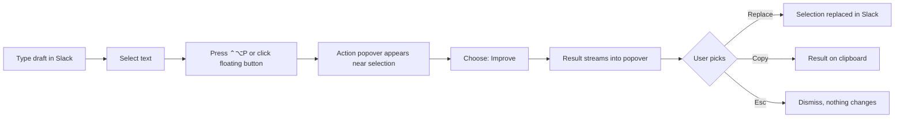
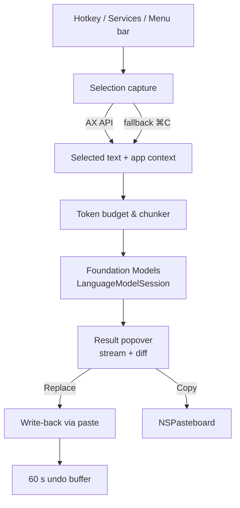

# PRD: Verbaine — On-Device Writing Assistant for macOS

2026-09-18 · Saswat

## Overview

Verbaine is a menu-bar Mac app that fixes, improves, or summarizes any text you select in any app, on-device by default, using Apple's Foundation Models framework. Select text in Slack, Mail, Notes or a browser, press a hotkey, pick an action, and either copy the result or replace the selection in place. No account, no cloud, no data leaves the Mac — unless you configure your own API endpoint, and the menu bar says so whenever that's active.

**One-line pitch:** Grammarly-style writing help for every Mac app, private by design and free to run because the model ships with macOS.

*Working name: Verbaine. Alternatives to consider: Tidy, Redraft, Quill.*

## Problem & opportunity

People write all day in apps that give them no help: Slack, Mail, Teams, Jira, browser text fields. Existing fixes are either cloud services (Grammarly, ChatGPT) that send every keystroke or message off the machine, or copy-paste round-trips to a chat window that break flow.

Apple's on-device model changes the economics. Every Apple Silicon Mac on macOS 26 with Apple Intelligence already has a ~3B-parameter LLM installed, free to call, with zero per-request cost and no network. Nobody has yet made it feel native across all apps.

**Why now**

- Apple Intelligence Writing Tools exist, but only in apps that adopt the standard text system. Slack, Electron apps and many browsers get partial or no support.
- Privacy-sensitive users (legal, finance, healthcare, enterprise with DLP policies) cannot use cloud grammar tools at all.
- The 4,096-token window rules out long-document work, but it is comfortably enough for messages, emails and paragraphs, which is where most day-to-day writing happens.

## Goals, non-goals & success metrics

**Goals (v1)**

1. Work in any Mac app where text can be selected, including Slack, Electron apps and browsers.
2. Selection → result in under 3 seconds for a typical message (≤ 150 words) on an M1.
3. On-device by default. Text leaves the Mac only when the user configures their own API endpoint in Settings, and the menu-bar icon and popover say so whenever that is active.
4. Zero-friction output: one click to copy, one click to replace the original selection.
5. Honest degradation: when text is too long for one pass, chunk it or tell the user, never silently truncate.

**Non-goals (v1)**

- Long-document editing (essays, reports over ~2,000 words).
- Real-time underline-as-you-type checking.
- iOS / iPadOS version.
- Translation between languages (revisit in v2; on-device model quality for Indian languages needs testing first).
- Using a ChatGPT or Claude consumer subscription in place of an API key. Consumer chat subscriptions grant no API access, so there is nothing for a third-party app to call.

**Success metrics**

| Metric | Target (90 days after launch) |
| --- | --- |
| Selection-to-result latency, p50 (≤150 words, M1) | < 3 s |
| Actions per active user per day | ≥ 5 |
| Replace-in-place success rate (no manual fix needed) | ≥ 95% |
| Weekly retention (week 4) | ≥ 40% |
| Context-window errors surfaced to user | < 1% of actions |
| App Store rating | ≥ 4.5 |

## Target users

| Persona | Situation | What they need from Verbaine |
| --- | --- | --- |
| Non-native English professional | Writes 30–50 Slack messages and 10 emails a day; second-guesses grammar and tone before sending | Fix grammar and make it sound natural in one keystroke, without leaving Slack |
| Engineer / IC | Terse, rushed messages; long threads to catch up on | Improve clarity, summarize a pasted thread, turn notes into a tidy update |
| Manager / lead | Writes announcements and feedback; tone matters | Rewrite as professional / friendly / concise; shorten without losing meaning |
| Privacy-constrained user (legal, finance, health, regulated enterprise) | Company policy forbids cloud AI on work text | Runs entirely on-device; text leaves the Mac only if you configure a custom endpoint yourself |

**Primary persona for v1:** the non-native English professional on Slack and Mail. Every v1 decision is judged against their flow first.

## Core user flows

**Flow 1 — Improve a Slack message (the hero flow)**

The popover shows original and result side by side, with changed words highlighted. Replace is the primary button; Copy is secondary. Esc always dismisses without side effects.

**Flow 2 — Summarize a long thread**

1. User selects a thread or long email (may be several thousand words).
2. Chooses Summarize. Verbaine shows a token estimate and, if over budget, says "Long text, summarizing in N parts".
3. Chunked map-reduce runs (see Context limit section); progress bar shows parts completed.
4. Result appears as 3–5 bullets or a short paragraph (user setting). Copy is primary here since a summary rarely replaces the source.

**Flow 3 — Quick action without opening the popover**

Power users assign per-action hotkeys, e.g. ⌃⌥G = fix grammar and replace immediately. No UI shown unless the model is unsure or the text is over budget. A subtle toast confirms "Replaced · Undo ⌘Z".

**Flow 4 — Undo**

After a Replace, Verbaine keeps the original for 60 seconds. ⌘Z in the popover or clicking the toast restores it. Verbaine also tries to keep the host app's native undo stack intact by replacing via a paste operation rather than raw Accessibility writes.

**Entry points**

| Entry point | How it works | Notes |
| --- | --- | --- |
| Global hotkey | Default ⌃⌥P; user-configurable | Primary, works everywhere |
| Floating button on selection | Small pill appears near selected text after ~400 ms | Optional, off by default; some users find it noisy |
| Menu bar icon | Click → act on current selection or clipboard | Fallback when hotkey conflicts |
| macOS Services menu | Right-click → Services → Verbaine: Improve | Free integration in Cocoa apps; unreliable in Electron |
| Clipboard mode | Copy text, open Verbaine, act on clipboard | Last resort for apps where selection can't be read |

## Feature set

The 4K window is a constraint, but short-text transformations are exactly what a 3B on-device model does well. Each action below is a single-shot prompt with a fresh session, so the full window is available every time.

**MVP actions (v1)**

| Action | Prompt behaviour | Output shape | Default button |
| --- | --- | --- | --- |
| Fix grammar | Correct spelling, grammar, punctuation only; keep wording and tone | Same length as input | Replace |
| Improve | Fix grammar and make it clearer and more natural; keep meaning and length within ±20% | Same length | Replace |
| Summarize | Condense to 3 bullets or 2 sentences (user setting) | Shorter | Copy |
| Shorten | Cut ~40% while keeping every fact | Shorter | Replace |
| Change tone | Sub-menu: Professional, Friendly, Direct, Apologetic | Same length | Replace |
| Expand | Turn bullets or a terse note into full sentences | Longer | Replace |

**Additional features that suit a small local model (v1.x–v2)**

1. **Reply drafts.** Select an incoming message, choose Reply → Verbaine drafts a short response you can edit before sending. Fits easily in budget because the input is one message.
2. **Explain / simplify.** Select jargon or a dense paragraph and get a plain-English version. Useful for engineers reading legal or product text.
3. **Extract action items.** From a selected thread or meeting note, produce a checklist. Uses `@Generable` structured output so the result is a real list, not free text.
4. **Bullets ↔ prose.** Convert a list into a paragraph or vice versa.
5. **Title / subject line.** Generate 3 subject lines or headings for a selected email or doc section.
6. **Custom actions.** User writes their own instruction ("rewrite as a haiku", "make it sound like a release note") and saves it with a hotkey. This is the feature that makes the app sticky.
7. **Smart clipboard history.** Every result kept locally for 24 h, searchable from the menu bar.
8. **Text-field aware presets.** Detect the frontmost app and default to a fitting tone: Slack → Friendly, Mail → Professional, Jira → Direct.
9. **Batch grammar pass.** For long documents, run Fix grammar paragraph-by-paragraph and show a diff view, so long text still works within the window.
10. **Fill-in-the-blank templates.** Standup update, PR description, out-of-office — the model fills a short template from selected notes.
11. **Tag / classify.** Label a message as Question / Request / FYI / Urgent for triage; a tiny structured-output call.
12. **Word and sentence variations.** Select a single word or phrase and get 5 alternatives inline.

**Explicitly excluded because of the model**

- Anything needing long-range memory across a whole document (consistency checks, cross-references).
- Fact-heavy generation (the model may hallucinate details; every action is framed as a transformation of the user's own text, never as new information).
- Chat. Multi-turn conversation eats the window quickly and is not the product.

## Working within the 4,096-token context limit

The limit is fixed and covers everything: instructions, prompt, any `@Generable` schema, and the model's output, all in one session. For a rewrite that returns text roughly as long as the input, that means the input can be at most ~1,700 tokens (~1,200 English words, roughly 3–4 characters per token in Latin scripts, ~1 character per token for CJK).

**Token budget per action (single pass)**

| Component | Budget |
| --- | --- |
| Instructions (kept to 2–3 imperative sentences) | ≤ 120 tokens |
| Prompt wrapper ("Improve this text:") | ≤ 30 tokens |
| User text | variable |
| Output reserve — rewrite actions | = input × 1.3 |
| Output reserve — summarize / shorten | ≤ 400 tokens |
| Safety margin | 150 tokens |

**Rule:** before every call, measure with `SystemLanguageModel.tokenCount(for:)` and compare to `contextSize`. Never guess.

**Strategy by text length**

| Input size | Rewrite actions (Fix, Improve, Tone) | Summarize |
| --- | --- | --- |
| ≤ 1,700 tokens | One pass, fresh session | One pass |
| 1,700–12,000 tokens | Paragraph-by-paragraph: split on paragraph boundaries, one session each, stitch results in order; show a diff view | Map-reduce: summarize each chunk (carrying the previous chunk's summary forward for continuity), then summarize the summaries |
| > 12,000 tokens | Offer batch grammar pass only; warn that Improve on very long text will be slow | Two-level map-reduce; show progress and allow cancel |

**Chunking rules**

- Split on paragraph, then sentence boundaries (`NLTokenizer`), never mid-sentence.
- For rewrites, never merge chunks: one paragraph in → one paragraph out, so stitching is trivial and formatting survives.
- For summaries, chunks of ~2,500 tokens with a 1-sentence overlap. Prepend the previous chunk's summary (capped at 150 tokens) for continuity.
- Run chunks sequentially by default; the model is a shared system resource and parallel sessions gain little.

**Guardrails**

- Catch `LanguageModelError.contextSizeExceeded` and retry once with a smaller chunk before surfacing an error.
- Use `maximumResponseTokens` only as a hard ceiling, never to shape length; a truncated rewrite is worse than a refusal. Control length through the prompt ("in three sentences").
- Keep `@Generable` types minimal (short property names, no `@Guide` unless needed) because the schema costs tokens.
- No system instructions carried between calls; every action starts a new `LanguageModelSession`, so there is no drift and no accumulated history.
- Profile with the Foundation Models instrument in Xcode during development and log `usage` (total, cache-read) per action in debug builds.

**Anticipating growth.** If Apple raises the window in a future OS, `contextSize` returns the new number and the budgets above scale automatically; nothing is hard-coded to 4,096.

## Technical architecture

A menu-bar SwiftUI app (`LSUIElement`, no Dock icon) with four layers: capture selection, run the model, present the result, write it back.

**1. Selection capture**

| Method | Works in | Notes |
| --- | --- | --- |
| Accessibility API (`AXUIElement`, `kAXSelectedTextAttribute`) | Native Cocoa apps, Mail, Notes, Safari | Needs Accessibility permission; gives text and the focused element for write-back |
| Simulated ⌘C then read pasteboard | Slack, Electron, Chrome, Figma | Save and restore the user's clipboard around it; add a 50–100 ms wait |
| Services menu (`NSServices`) | Cocoa apps | Free but not reliably exposed in Electron |

Slack (Electron) exposes limited AX attributes for its composer, so the pasteboard method is the default there. The capture layer tries AX first and falls back automatically; a per-app override list lives in settings.

**2. Model layer**

- `SystemLanguageModel.default`, checked via `availability` at launch. If unavailable (Intel Mac, Apple Intelligence off, model downloading) the app shows a clear setup screen instead of a broken button.
- One `LanguageModelSession` per action, `prewarm()` called when the popover opens so first-token latency is low.
- Streaming via `streamResponse` so text appears progressively in the popover.
- Structured actions (action items, classify) use `@Generable` types; plain rewrites return `String`.
- Prompts live in a versioned `Prompts.swift` with one instruction string per action, each under 120 tokens.
- Content guardrails: the framework's safety filter may refuse some inputs (e.g. text containing profanity in a Slack rant). Catch `GenerationError.guardrailViolation` and show "Verbaine can't process this text" rather than a generic error.

**3. Result UI**

- Non-activating `NSPanel` positioned near the selection (from AX bounds, or near the cursor as fallback).
- Two-pane view: original left, result right, word-level diff highlighting.
- Buttons: Replace (⏎), Copy (⌘C), Retry, Esc. Tone actions expose a segmented picker.

**4. Write-back (Replace)**

1. Store the original and the result in the undo buffer.
2. Put the result on the pasteboard (marking it transient so clipboard managers ignore it).
3. Re-activate the source app and send ⌘V via `CGEvent`. The selection is still active, so paste replaces it and the host app's own undo stack records the change.
4. Restore the user's previous clipboard contents after ~300 ms.

Using paste rather than `AXValue` writes is what makes Replace work in Slack and browsers, and it keeps ⌘Z working inside the host app.

**Stack**

- Swift 6, SwiftUI + AppKit for panels, Swift Concurrency.
- Frameworks: FoundationModels, ApplicationServices (AX), Carbon `RegisterEventHotKey` or a small hotkey package, NaturalLanguage (sentence splitting).
- No third-party analytics SDK. Optional anonymous, on-device-aggregated usage counters, off by default.
- Distribution: Mac App Store and notarized direct download.

## Platform requirements, permissions & privacy

**Requirements**

- macOS 26 or later (26.4+ recommended for `contextSize`, `tokenCount(for:)` and usage reporting; both are back-deployed but behave best on 26.4).
- Apple Silicon Mac (M1 or later). Intel Macs are unsupported by Apple Intelligence.
- Apple Intelligence enabled in System Settings; the model may take a few minutes to download on first enable.
- English is the primary supported language for v1. Other Apple Intelligence languages are enabled but untested; Hindi and other Indian-language quality is an open question to evaluate before advertising it.

**Permissions requested**

| Permission | Why | When asked |
| --- | --- | --- |
| Accessibility | Read selected text, find its bounds, send ⌘C / ⌘V | Onboarding, with a short explainer and a Test button |
| Input Monitoring | Global hotkey on some configurations | Only if the hotkey API needs it |
| Network | Outgoing only (`com.apple.security.network.client`), and only to the endpoint the user configures. Unused when running on-device, which is the default | Never prompted — macOS does not gate outgoing connections |

**Privacy posture**

- Inference is on-device via Foundation Models by default; text never leaves the Mac and is never logged in release builds. A user who configures their own OpenAI-compatible endpoint sends selected text to that endpoint instead, and only then. The API key is stored in the Keychain and is never logged.
- Undo buffer and clipboard history are in-memory only, cleared on quit; optional 24 h history is stored encrypted in the app container and can be disabled.
- Privacy manifest declares no tracking, no data collection. This should be the headline of the App Store listing.
- Sandbox: App Store build runs sandboxed; Accessibility use is allowed with the user's permission, and the paste-based write-back avoids needing broader automation entitlements. Verify this in review early with a TestFlight build.

**App Store considerations**

- Apple's own Writing Tools cover part of this; the differentiators to state in the listing are "works in every app including Slack and Chrome", custom actions, and summaries of long text.
- Menu-bar-only apps are accepted but must have a discoverable settings window and a way to quit.

## Roadmap

Solo-developer estimates; each phase ends with a testable build.

| Phase | Scope | Duration | Exit criterion |
| --- | --- | --- | --- |
| 0 — Spike | Prove selection capture + paste-back in Slack, Chrome, Mail; measure model latency and token counts on M1 | 1 week | Improve works end-to-end in Slack via hotkey |
| 1 — MVP | Six core actions, popover with diff, Copy / Replace / Undo, onboarding for Accessibility, settings | 4 weeks | TestFlight to 20 users |
| 2 — Long text | Token budgeting, paragraph-by-paragraph rewrite, map-reduce summarize, progress UI | 2 weeks | 5,000-word thread summarizes without error |
| 3 — Launch | Custom actions, per-action hotkeys, app-aware tone presets, App Store submission | 3 weeks | Approved on Mac App Store |
| 4 — v1.x | Reply drafts, action items, explain/simplify, clipboard history, Indian-language evaluation | ongoing | Decided by usage data |

**Open decision for phase 3:** free with a one-time unlock for custom actions, or fully free to build an audience first. Leaning toward a one-time purchase (no server costs to cover, so no subscription needed).

Step-by-step build tasks for Claude Code: see `TASKS.md`.

## Risks, open questions & assumptions

**Risks**

| Risk | Impact | Mitigation |
| --- | --- | --- |
| Model quality on a 3B model: awkward rewrites, occasional meaning drift | Users stop trusting Replace | Diff view before Replace; Retry button; conservative Fix-grammar prompt that changes only errors; evaluate 200 real messages in phase 0 |
| Safety filter refuses ordinary workplace text | Confusing failures | Detect `guardrailViolation`, show a specific message, offer Copy-original; log frequency in TestFlight |
| Selection capture breaks in Electron apps after an update | Hero flow fails in Slack | Pasteboard fallback is default for Electron; per-app override; automated smoke test against Slack and Chrome |
| Paste-based replace fires into the wrong field if focus changes | Text pasted somewhere unexpected | Verify frontmost app and focused element match the capture before pasting; abort and show Copy instead |
| Apple expands Writing Tools to cover the same use cases | Product becomes redundant | Lean on cross-app coverage, custom actions, and summarization of long text; ship fast |
| Apple Intelligence not enabled or unavailable in the user's region/language | App does nothing after install | Availability check at launch with step-by-step enable guide; state requirements clearly on the store page |
| Undo mismatch: host app undo restores partial state | Data loss feel | Keep Verbaine's own 60 s undo buffer independent of the host |

**Open questions**

- [ ] Does Slack's composer preserve formatting (bold, code, mentions) through a paste-replace, or is plain text acceptable?
- [ ] Which hotkey default has the fewest conflicts with common Mac apps?
- [ ] Hindi / Hinglish quality: good enough to advertise, or English-only at launch?
- [ ] Pricing model: one-time purchase vs free.
- [ ] Should the floating selection button ship on by default?

**Assumptions**

- The 4,096-token window stays fixed for the macOS 26 cycle; budgets read `contextSize` so a larger window is picked up automatically.
- Most target-persona inputs are under 300 words, so single-pass handles > 90% of actions.
- Accessibility permission is an acceptable ask for the target audience, given the privacy positioning.

## Sources

- [Managing the context window — Apple Developer Documentation](https://developer.apple.com/documentation/foundationmodels/managing-the-context-window)
- [Instructions — Foundation Models — Apple Developer Documentation](https://developer.apple.com/documentation/foundationmodels/instructions.md)
- [FoundationModel context length thread — Apple Developer Forums](https://developer.apple.com/forums/thread/806542)
- [Tracking token usage in Foundation Models — Artem Novichkov](https://artemnovichkov.com/blog/tracking-token-usage-in-foundation-models)
- [Putting Apple Foundation Models in a real app — Vadim Drobinin](https://drobinin.com/consulting/foundation-models-apple-intelligence/putting-apple-foundation-models-in-a-real-app/)
